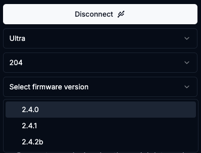

# Build Factory Images With Docker

build-images.sh is a script that builds the factory images with only Docker as a dependency. 

After the images are built the script runs the web flasher to allow flashing the Bitaxe
 with the newly built dev images. It should open your default browser to http://localhost:3000.

## Requirements

Docker must be installed. https://docs.docker.com/get-started/get-docker/

ESP_MINER_PATH must be set to the path of the ESP-Miner project. 

```shell
export ESP_MINER_PATH=~/dev/ESP-Miner
```

It can be set when running the build-images.sh script.

```shell
./image-factory/build-images.sh ESP_MINER_PATH=~/dev/ESP-Miner -t mytag
```

## Building Images

The command is run from the web flasher project root `./image-factory/build-images.sh`. To build images 
for all boards specify a tag. The tag defaults to `dev`.

```shell
./image-factory/build-images.sh -t 2.4.2b
```

To build an image for a specific board using expressif/idf version v5.5-dev

```shell
./image-factory/build-images.sh -e v5.5-dev -b 204 -t PR-609
```

 If the images were already built previously you can launch the web flasher only with

```shell
./image-factory/build-images.sh -f
```

## Image Location

This build process puts the factory images into the `image-factory` directory.  The images 
are named `esp-miner-factory-<board>-<tag>.bin`.  The web flasher is configured to look for 
these local images by loading the `firmware_data.csv` file, supplementing the existing released firmware.



